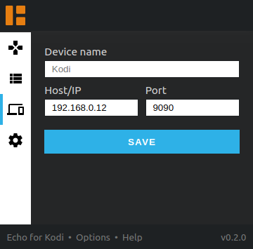

# Echo for [Kodi](https://github.com/xbmc/xbmc) &horbar; Browser Extension

Echo for Kodi lets you share your favorite content with Kodi (XBMC).

Should work with all [WebExtension](https://developer.mozilla.org/en-US/Add-ons/WebExtensions) compatible browsers 
including Mozilla Firefox, Google Chrome and Microsoft Edge.

If you want to try a more complete and robust extension, 
consider installing the [Play to Kodi](https://github.com/khloke/play-to-xbmc-chrome) Chrome extension.
Check out the [comparison between Echo for Kodi and Play to Kodi](#comparison-with-play-to-kodi) for more details.

## Features

* Lets you easily share content from websites with Kodi.
* Uses as few permissions as possible & respects your privacy.
* Does not break websites by avoiding to inject scripts.
* Built with the latest technologies the web offers.

## Installation

* [Mozilla Firefox](https://addons.mozilla.org/de/firefox/addon/echo-for-kodi/)
* Google Chrome (currently not available in the Chrome Web Store)

<!-- TODO Test in in Microsoft Edge -->

### Enabling & Configuring

Visit Kodi &rarr; Settings &rarr; Services &rarr; Control.

* Enable "Allow remote control from applications on other systems"

> For security reasons Kodi should be run inside a private and trusted network!

## Permissions

This extension requires the permission

* to **access your active browser tab**   
  This allows the extension to extract information from your current URL, like the Youtube video ID.
* to **store data** in your browser   
  This allows the extension to save your settings, like your Kodi IP and Kodi credentials.
* to **add menu entries** to your context menu   
  This allows the extension to show you controls in your context menu.
  
### Optional permissions

In order to allow the extension to show you a "Replay" dialog if a media item finished playing,
it requires the permission

* to **send you notifications**   

For more information on permissions, visit [developer.mozilla.org](https://developer.mozilla.org/en-US/Add-ons/WebExtensions/manifest.json/permissions).

## Privacy

This extension does not collect any kind of data and will never do.

It only sends requests to your configured Kodi host.

## Sharing content to Kodi

#### Supported websites

| Website            | Kodi Plugin                                                         |
| ------------------ | ------------------------------------------------------------------- |
| mixcloud.com       | [plugin.audio.mixcloud](https://kodi.wiki/view/Add-on:MixCloud)     |
| soundcloud.com     | [plugin.audio.soundcloud](https://kodi.wiki/view/Add-on:SoundCloud) |
| twitch.tv          | [plugin.video.twitch](https://kodi.wiki/view/Add-on:TwitchTV)       |
| vimeo.com          | [plugin.video.vimeo](https://kodi.wiki/view/Add-on:Vimeo)           |
| youtube.com        | [plugin.video.youtube](https://kodi.wiki/view/Add-on:YouTube)       |

#### Comparison with Play to Kodi

|                        | Echo for Kodi | [Play to Kodi](https://github.com/khloke/play-to-xbmc-chrome) |
| ---------------------- | ------------- | ------------ |
| Avoids content scripts | ✅             | ❎           |
| Adds a context menu    | ✅             | ✅           |
| Replay notifications   | ✅             | ❎           |
| Key mappings           | ❎             | ✅           |
| Favorites              | ❎             | ✅           |
| Multiple devices       | ❎             | ✅           |
| Number of plugins      | 5             | \> 30        |
| Languages (i18n)       | 2 (en, de)    | 1 (en)       |
| Communication          | WebSockets    | HTTP         |
| Uses standard WebExtensions API | ✅    | ❎           |

## Development

### Build

Run `npm run build`.

### Develop

Run `npm start`.

### Roadmap

* Improve display of files (Youtube, Soundcloud, ...) in playlist view
* Disable play button if website is not supported
* Add key mappings (enter = share, space = play/pause, q = queue)
  * [Support media keys](https://developer.mozilla.org/en-US/docs/Mozilla/Add-ons/WebExtensions/manifest.json/commands#Media_keys)
* Publish as Chrome Extension and Microsoft Edge Extension
  * Add badge for Chrome addon (https://github.com/badges/shields)
* Consider implementing a "Play this next" feature
* Get rid of `unsafe-inline` in content security policy
* Test critical code
* Support usage of multiple devices

## Attributions

The design of this extension is strongly influenced by the 
awesome Kodi projects [Chorus2](https://github.com/xbmc/chorus2) and [Kore](https://github.com/xbmc/Kore).

## Copyright and license

Echo for Kodi is licensed under the MIT License - see the `LICENSE` file for details.
